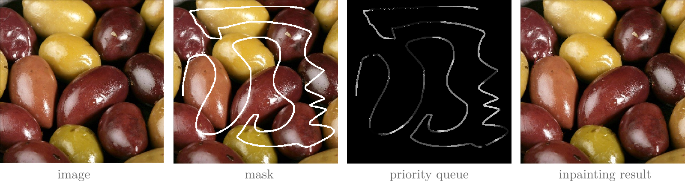

## Patch-based Inpainting

MATLAB/C-Mex re-implementation of paper:   [PDF](https://www.irisa.fr/vista/Papers/2004_ip_criminisi.pdf)
```
@article{criminisi2004region,
  title={Region filling and object removal by exemplar-based image inpainting},
  author={Criminisi, Antonio and P{\'e}rez, Patrick and Toyama, Kentaro},
  journal={IEEE Transactions on image processing},
  volume={13},
  number={9},
  pages={1200--1212},
  year={2004}
}
```

### Overview 




### Execution

```
run main.m
```
